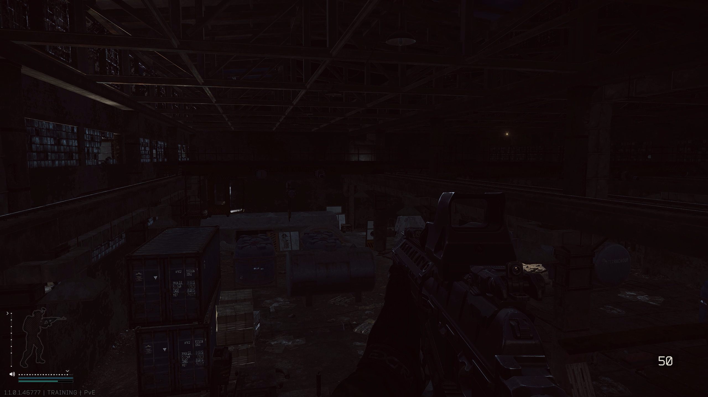

# TarkovAutoShade

TarkovAutoShade 是一个运行在 Windows 上的本地 SDR 显示滤镜工具，面向《Escape from Tarkov》的暗部可见度和高光舒适度优化。

本项目通过 Vibe Coding 方式完成。

## 功能概览

- 监听游戏截图目录，检测新截图后自动分析画面。
- 根据截图的亮度、动态范围和颜色分布生成当前场景的 RGB Gamma Ramp。
- 自动增强暗部，同时限制天空、窗户、灯光和夜视画面的过度提亮。
- 支持自然中性、室内柔和、夜视护眼、高光保护和自定义预设。
- 支持手动分析、实时预览、全局快捷键切换和滤镜平滑过渡。
- 可选读取显示器 DDC/CI 硬件亮度和对比度能力；不支持时不会伪装成可用功能。

## 效果演示

### 夜间与夜视仪场景

以下图片按同一场景中的实际操作顺序排列，用于展示自动启动、夜视保护和滤镜更新的效果。

#### 1. 夜间室内，滤镜关闭



#### 2. 生成截图后自动启动滤镜


#### 3. 滤镜开启时使用夜视仪


#### 4. 夜视仪开启时更新滤镜


## 本地运行与隐私

程序使用 Windows 本地能力完成以下工作：

- 读取本机截图文件。
- 分析截图的像素数据。
- 使用 Windows `SetDeviceGammaRamp` 应用显示器 Gamma 曲线。
- 保存本机设置和异常退出恢复数据。
- 可选读取本机显示器的 DDC/CI 信息。

程序不读取游戏进程内存、不注入 DLL、不创建游戏覆盖层，也不模拟键鼠输入。

## 工作流程

默认情况下，程序会按下面的流程工作：

```text
游戏生成截图
    |
    v
监听截图目录并等待文件写入完成
    |
    v
缩放截图并提取亮度、颜色、动态范围等特征
    |
    v
结合用户参数计算当前场景的推荐曲线
    |
    v
生成 256 级 RGB Gamma Ramp
    |
    v
平滑应用到所选显示器
```

截图目录的默认位置是：

```text
文档\Escape from Tarkov\Screenshots
```

程序启动时会优先自动查找这个目录。如果目录不存在或无法访问，界面会提示用户点击“选择目录”手动选择。目录配置会保存在本机设置中。

## 自动分析和参数的关系

这是本工具最重要的工作原理：界面中的参数是固定的算法设置，但最终滤镜不是固定常数。

可以把计算关系简化为：

```text
最终滤镜 = 自动分析(当前截图) + 用户参数约束
```

更准确地说：

```text
LUT = ToneCurve(图像特征, AppSettings)
```

其中：

- `AppSettings` 是界面中保存的固定参数，例如暗部可见度、高光保护和最大调整强度。
- `图像特征` 是当前截图计算出的亮度分位数、颜色均值、动态范围和场景特征。
- `LUT` 是本次实际应用的 256 级红、绿、蓝 Gamma 曲线。

因此，固定参数并不意味着每张截图都使用完全相同的亮度、Gamma 和对比度。固定的是算法的偏好、权重、保护程度和强度上限；截图内容决定本次应该使用多少暗部增强和高光保护。

例如默认参数为：

```text
暗部可见度 = 70
高光保护 = 76
最大调整强度 = 82
```

在明亮室外截图中，算法会检测到较高的中位亮度和高光分位数，于是减少暗部提亮并加强高光压缩。在暗室截图中，算法会检测到较低的中位亮度和较低的 P10，于是提高暗部增强和可见度。两张截图使用相同的参数，但最终曲线不同，这是自动分析的预期结果。

如果同一张截图的像素内容和参数完全相同，算法会生成相同的结果；它不会随机改变滤镜。

### 截图分析的主要数据

程序会将截图缩放到约 `320 x 180` 后分析画面主体区域，减少窗口边缘、HUD 和武器对结果的影响。主要数据包括：

- `P10`：偏暗区域的亮度，用于判断暗部缺失程度。
- `Median / P50`：画面整体的典型亮度，用于判断明暗场景。
- `P75 / P95`：中高亮和高光区域的亮度，用于保护天空、灯光和窗户。
- `DynamicRange`：亮暗范围，用于判断画面是否扁平、发灰或对比过强。
- `BrightFraction`：高亮像素比例，用于辅助判断室外和强光环境。
- `MeanRed / MeanGreen / MeanBlue`：颜色通道均值，用于色偏校正和色彩浓度处理。
- `NightVisionScore`：偏绿且偏暗的夜视特征，用于夜视保护。

算法使用这些数据计算 `darkScore`、`brightScore`、`backlightScore`、`outdoorEvidence`、`protectionScore` 等中间分数，再生成当前截图的实际曲线。

### 参数说明

#### 自动算法偏好

这些参数控制算法面对不同环境时的倾向，不会在分析后自动变成另一组数值。

| 参数 | 默认值 | 实际作用 |
| --- | ---: | --- |
| 暗部可见度 | `70` | 提高暗场增强倾向。数值越高，暗场允许的提亮范围越大。 |
| 高光保护 | `76` | 保护天空、窗户、灯光和高亮区域。数值越高，检测到高光时越会抑制提亮。 |
| 色偏校正 | `72` | 根据截图的 RGB 平均值进行轻量通道平衡，减少整体偏色。 |
| 室内柔和 | `72` | 检测到室内特征时，降低中间调冲击并增加柔和压缩。 |
| 过亮 / 夜视保护 | `88` | 保护强光、逆光和偏绿夜视场景，避免自动增强过度。 |
| 黑位 / 去灰 | `56` | 在提亮暗部后恢复黑色分离度，减少灰雾感。过高可能损失暗部细节。 |
| 最大调整强度 | `82` | 将生成曲线与原始曲线混合的最大比例。不是亮度值，也不是 Gamma 值。 |

#### 画面微调

这些参数是在自动分析结果上进行的固定偏移：

| 参数 | 默认值 | 实际作用 |
| --- | ---: | --- |
| 亮度微调 | `0` | 在自动结果基础上提高或降低整体曝光倾向。高光保护会限制它在强光场景中的作用。 |
| 对比度微调 | `0` | 在自动结果基础上增加或减少明暗分离。 |
| 暖色舒适度 | `0` | 正值增加暖色倾向，负值增加冷色倾向。 |
| 色彩浓度 | `0` | 增加或降低颜色通道相对于画面亮度的距离，调整色彩浓度。 |

当前界面底部显示的“等效 Gamma”、亮度调整和对比度调整，是针对最近一次截图计算出的实际结果，不是滑块的固定参数值。

需要注意：界面显示的“等效 Gamma”是便于理解的显示指标，程序内部使用其倒数生成 Gamma 曲线。因此等效 Gamma 变大，通常意味着暗部提升倾向变强，并不等于画面变暗。

## 快捷预设

快捷预设只是不同的参数组合，选择预设后仍然会根据每张截图重新计算最终曲线：

- `自动分析`：使用默认的自动分析参数。
- `自然中性`：降低滤镜存在感，适合亮度较均衡的场景。
- `室内柔和`：增加室内暗部可见度并降低对比冲击。
- `夜视护眼`：限制夜视画面继续变亮，优先保护高光和颜色。
- `高光保护`：适合雪地、天空、窗户和强灯光场景。
- `自定义预设`：保存用户当前的参数组合。

## 使用方法

1.运行 `TarkovAutoShade.exe`。
2. 确认目标显示器和截图目录。默认目录找不到时，点击“选择目录”。
3. 确认“自动监听新截图并应用”已开启。
4. 进入新的室内、室外、夜视或逆光环境后，在游戏中生成一张截图。
5. 等待截图写入完成，程序会显示分析结果并平滑应用新曲线。
6. 使用界面显示的全局快捷键切换滤镜。当前默认快捷键是 `F8`，可以在设置中修改。

关闭滤镜后，程序仍会继续监听截图目录；检测到新的截图时，会自动分析并重新开启滤镜，应用当前场景对应的新曲线。

## 显示范围和限制

- Gamma Ramp 作用于所选显示器的整个 SDR 桌面，不只作用于游戏窗口。
- HDR 模式、独占全屏、显卡驱动或其他色彩管理软件可能覆盖或忽略 Gamma Ramp。
- 程序不会增加纹理分辨率，也不会替代游戏内抗锯齿、锐化或显示器硬件亮度设置。
- 平滑过渡只改变曲线应用过程，不改变自动分析的最终目标曲线。
- 显示器硬件亮度和对比度只有在检测到 DDC/CI 支持时才可用。
- 程序会在本机保存设置和异常退出恢复数据，不会上传截图或分析结果。

## 构建

要求：

- Windows 10 或 Windows 11
- Visual Studio 2019/2022 的 MSBuild，或可用的 .NET Framework 编译环境

在仓库根目录执行：

```powershell
.\build.ps1
```

生成文件：

```text
bin-wpf/TarkovAutoShade.exe
```

构建脚本会自动查找常见的 Visual Studio MSBuild 路径，并以 Release 配置构建当前 WPF 项目。

## 项目结构

```text
src/                       核心算法、截图监听、Gamma Ramp 和本地存储
src-wpf/                   WPF 界面和应用程序入口
assets/                    程序图标
tools/                     算法与集成测试辅助程序
build.ps1                 Release 构建脚本
```

## 许可证与分享声明

本工具免费分享，禁止倒卖。

作者：`lub大萝卜`  
B站主页：[lub大萝卜](https://space.bilibili.com/66741964)  
爱发电主页：[lub大萝卜](https://afdian.com/a/lublub)  
GitHub仓库：[TarkovAutoShade](https://github.com/lu1249765686/TarkovAutoShade)
